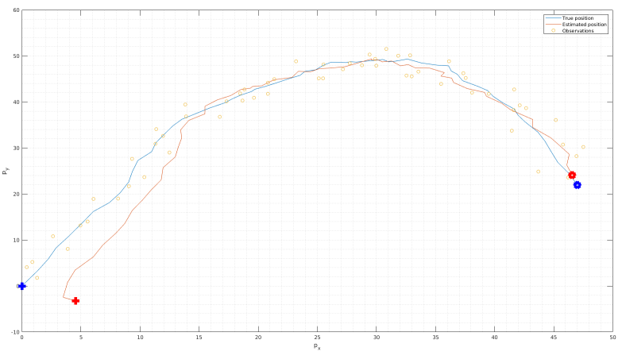

# KFExample
Kalman Filter Matlab implementation example.  
This program implements the standard Kalman filter over two models:
- Constant Velocity (CV)
- Constant Acceleration (CA)
and four nonlinear filters (EKF, UKF, CKF, PF) over a scalar model.

For the linear filtering:
It provides a series of parameters to play with, which account for the perturbations in both the state and measurements of the system, the filter process and measurement noise and some other tuning factors.  
The real and estimated trajectory are shown at the end, together with the real (cleared of noise) and corrupted measurements.

For the nonlinear filtering:
The performance of the EKF, UKF, CKF and PF are compared in terms of RMSE over a highly nonlinear scenario.

The Kalman filter task is to retrieve the best estimate of system state from a series of noisy observations made on that system.
